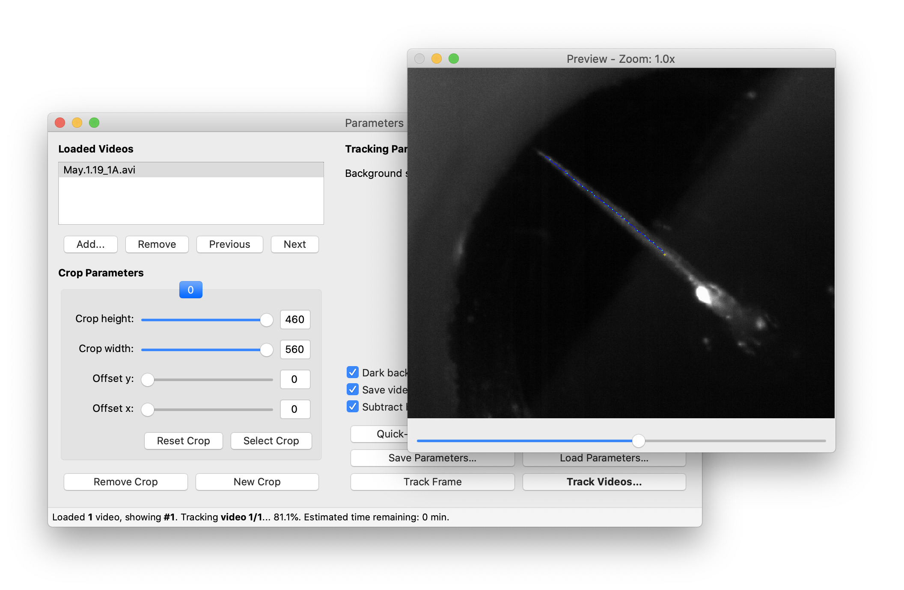

# Zebrafish Tracking Toolkit

## Dependencies
This software requires Python 2 or 3 to be installed, as well as the following Python modules:
- `numpy`
- `scipy`
- `matplotlib`
- `opencv`
- `pyqt`
- `moviepy`
- `scikit-image`

## Running
The GUI can be started by running:

`python gui.py`
